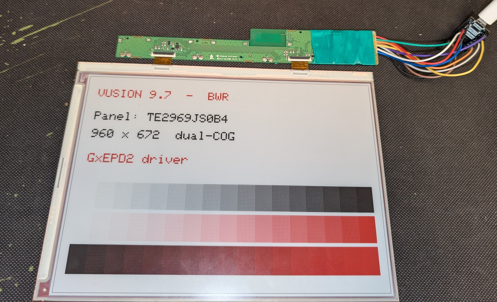
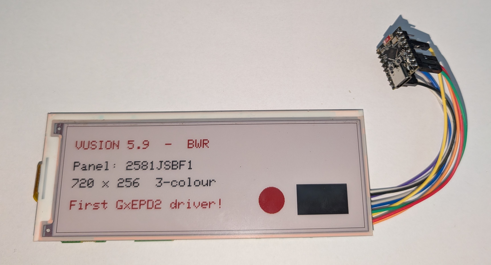
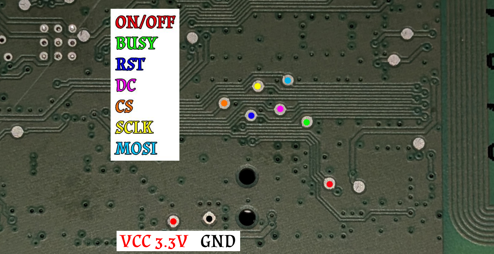
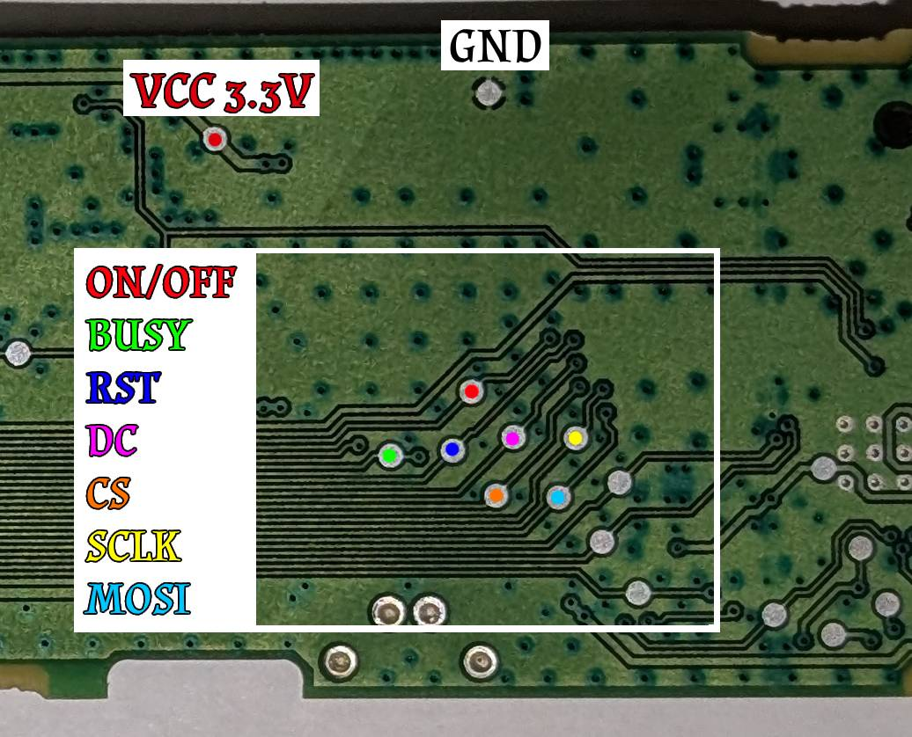
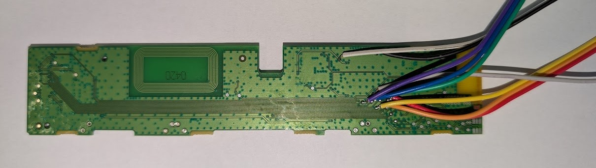
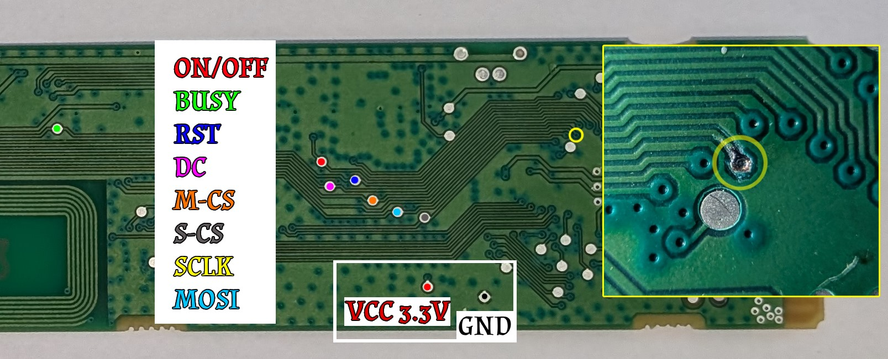

# GxEPD2_PervasiveDisplays

Add-on driver classes for **[GxEPD2](https://github.com/ZinggJM/GxEPD2)** that add support for
**Pervasive Displays "Spectra" BWR** e-paper panels — including the OEM panels found in
**SES-imagotag / VUSION electronic shelf labels (ESLs)** — which stock GxEPD2 does not support.

This is a **companion library**: you install it *alongside* GxEPD2, you don't replace GxEPD2.
The driver classes derive from `GxEPD2_EPD` and are used with the standard `GxEPD2_3C` template,
so all of GxEPD2 / Adafruit_GFX drawing works exactly as usual.

> These are the first known GxEPD2 drivers for Pervasive Displays / VUSION panels — including the
> 9.7" dual-COG panel and the 5.81" OEM variant that was fully reverse-engineered (no public
> datasheet or driver exists).



---

## Supported panels

| Class | Panel | Size | Res | Colour | Notes |
|-------|-------|------|-----|--------|-------|
| `GxEPD2_266c_SE2266JS0C5` | **SE2266JS0C5** — VUSION 2.6 BWR GU110 (EDG3-0260-A) | 2.66" | 296×152 | BWR | genuine Pervasive iTC, "small" COG |
| `GxEPD2_581c_SE2581JSBF1` | **SE2581JSBF1** — VUSION 5.9 BWR GU110 (EDG3-0590-A) | 5.81" | 720×256 | BWR | non-iTC, UC8179-family protocol, reverse-engineered |
| `GxEPD2_970c_TE2969JS0B4` | **TE2969JS0B4** — VUSION 9.7 BWR GU111 (EDG4-0970-A) | 9.7" | 960×672 | BWR | genuine Pervasive iTC "0B", dual-COG (master + slave) |

All three panels come from recycled **VUSION** (formerly **SES-imagotag**) electronic shelf labels.
The 2.66" and 9.7" are genuine Pervasive iTC controllers (the stock protocol works); the 5.81" is an
OEM variant with a non-iTC controller that had to be reverse-engineered (see notes below).

All are **3-colour** (black / white / red). Full refresh only (no partial update).



---

## Installation

### Arduino IDE
1. Install **GxEPD2** and **Adafruit GFX Library** via Library Manager.
2. Download this repo as ZIP → *Sketch → Include Library → Add .ZIP Library*.
3. Open an example: *File → Examples → GxEPD2_PervasiveDisplays*.

### PlatformIO
```ini
lib_deps =
    zinggjm/GxEPD2@^1.6.6
    adafruit/Adafruit GFX Library
    adafruit/Adafruit BusIO
    https://github.com/shanislav/GxEPD2_PervasiveDisplays.git
```

---

## Wiring (example: ESP32-C3 Super Mini)

> **Remove the original MCU first.** On every one of these VUSION boards you must **desolder the
> tag's original controller** (its secure-locked ESL MCU) before wiring in the ESP32 — the ESP
> *replaces* it and drives the panel directly. Leaving the old chip on the bus will fight the ESP
> for the SPI/CS lines. The test points below are the panel signals that were routed to that MCU.

| Panel pin | ESP32-C3 GPIO |
|-----------|---------------|
| CS   | 10 |
| DC   | 5  |
| RST  | 3  |
| BUSY | 1  |
| SCLK | 6  |
| MOSI / SDA | 7 |
| Panel power ON/OFF | 4 → drives the tag's **on-board** power MOSFET (LOW = on). For battery / power-gating — see [Low power](#low-power-battery) |

(The panel is write-only, so SPI MISO is unused — pass `-1` to `SPI.begin`.)

The panels need **3.3 V** on both supply *and* data lines. You don't *have* to reuse the tag PCB —
a universal e-paper breakout adapter carries the panel's boost circuitry too; the tag board just
happens to have it (plus the power MOSFET) already on it. The exception is the 9.7" with its two
FPCs — you're unlikely to find a universal adapter for that one, so reuse its tag board.

> The **VUSION 9.7" (dual-COG)** panel replaces `CS` with **two** chip-selects — see
> [its solder map below](#where-to-solder-on-the-vusion-97-board).

### Where to solder on the VUSION 2.6 board

These are the test points on the original PCB of a **VUSION 2.6 (SE2266JS0C5)** label — solder them to
the ESP32-C3 GPIOs in the table above. `ON/OFF` is the enable line of the board's **own power
MOSFET**, so wire it straight to a GPIO (we use GPIO4); no external MOSFET needed. Driving it LOW
powers the panel, HIGH cuts it (see [Low power](#low-power-battery)). `VCC 3.3V` and `GND` go to the
ESP's 3.3 V and GND pins.



Board for reference — [front (MCU side)](docs/board_vusion26_front.jpg) ·
[back (bare)](docs/board_vusion26.jpg).

### Where to solder on the VUSION 5.9 board

Same idea on a **VUSION 5.9 (SE2581JSBF1)** label — these test points go to the ESP32-C3 GPIOs in the
table above, and `ON/OFF` again drives the board's own power MOSFET (LOW = on, HIGH = off).



…and the same points with wires soldered on:



Board for reference — [front (MCU side)](docs/board_vusion59_front.jpg) ·
[back (bare)](docs/board_vusion59.jpg).

### Where to solder on the VUSION 9.7 board

The dual-COG **VUSION 9.7 (TE2969JS0B4)** uses **two** chip-selects — `M-CS`=GPIO10, `S-CS`=GPIO0.
The rest of the signals go to the same GPIOs as in the table above, and `ON/OFF` again drives the
board's own power MOSFET (LOW = on).

> ⚠️ **Not a beginner solder job.** On this board `SCLK` has **no test point** — you have to scrape
> the solder mask off a trace and tack a wire onto it (see the annotated photo). The rest have pads.



Soldered up: [wiring](docs/wiring_soldered_vusion97.jpg) · board [1](docs/board_vusion97.jpg) ·
[2](docs/board_vusion97_2.jpg).

### ⚠️ Do NOT wire panel signals to the ESP32-C3 strapping pins

The ESP32-C3 has **strapping pins** (notably **GPIO9 = BOOT** and **GPIO2**) that are sampled at
power-on to decide the boot mode. **Do not route DC / BUSY / any panel signal through them** unless
you really know what you're doing. The pinout above deliberately avoids them (DC on 5, BUSY on 1).

Why it bites you (learned the hard way):

- **GPIO9 = BOOT.** If it's LOW at power-on the chip enters *download mode* and your firmware never
  runs. If you put **DC on GPIO9** and the panel can be **unpowered** (battery / power-gated via a
  MOSFET), an unpowered panel drags GPIO9 LOW on cold boot → the board silently fails to start.
  The classic symptom: **cold power-up does nothing, but pressing RST "fixes" it** (a reset button
  doesn't re-sample the straps). → Keep DC on a normal pin (we use **GPIO5**).
- **GPIO2** must not be held LOW at boot either — a panel BUSY on GPIO2 can block boot/flash.
  → BUSY on **GPIO1**.

If you can't flash with the panel connected, disconnect the offending signal, flash, reconnect —
or just move it to a non-strapping pin.

---

## Usage

```cpp
#include <SPI.h>
#include <GxEPD2_3C.h>
#include "GxEPD2_581c_SE2581JSBF1.h"   // or GxEPD2_266c_SE2266JS0C5.h

GxEPD2_3C<GxEPD2_581c_SE2581JSBF1, GxEPD2_581c_SE2581JSBF1::HEIGHT> display(
  GxEPD2_581c_SE2581JSBF1(/*CS=*/10, /*DC=*/5, /*RST=*/3, /*BUSY=*/1)); // DC on 5, NOT 9 (strapping)

void setup() {
  pinMode(4, OUTPUT);
  digitalWrite(4, LOW); // tag board's power MOSFET: LOW = panel ON

  SPI.begin(/*SCLK=*/6, /*MISO=*/-1, /*MOSI=*/7, /*CS=*/10); // MISO unused (write-only panel)
  display.init(115200, true, 2, false);
  display.setRotation(0);

  display.setFullWindow();
  display.firstPage();
  do {
    display.fillScreen(GxEPD_WHITE);
    display.setTextColor(GxEPD_RED);
    display.setCursor(20, 40);
    display.print("Hello e-paper!");
  } while (display.nextPage());
}

void loop() {}
```

A full refresh takes ~20 s (the 9.7" ~40 s). See `examples/` for each panel.

---

## Panel notes & limitations

### SE2266JS0C5 (2.66")
- iTC "small C/J" COG. PSR value `{0xCF, 0x8D}` is hardcoded (not read from OTP).
- Data as two 1bpp planes: black (`0x10`) + red (`0x13`), 5624 bytes each.

### SE2581JSBF1 (VUSION 5.9") — reverse-engineered
This is an **OEM panel with no public datasheet**. It shares the size of the public Pervasive
`E2581JS0B` but uses a **different, non-iTC controller** — it doesn't answer the Pervasive OTP read
(`0xB9`), but responds to the **UC8179-family command set**, so Pervasive's own driver does **not**
work on it. The exact silicon is unknown (the COG is epoxy-blobbed); the controller was identified by
its command protocol, not by reading the chip. Key findings (also documented in the driver header):

- **Addressed as 720×512, not 720×256.** The controller RAM spans 720×512 but only the **top 256
  rows** are wired to the glass. `HEIGHT` is therefore **512**; each plane is 46080 bytes. Sending
  only a 720×256 buffer leaves half of the panel undriven. **Draw in Y = 0…255**; anything below is
  stored in RAM but invisible.
- **Panel setting (`0x00`) = `0x0E`.** The usual 3C value `0x0F` *hangs* this controller.
- **VCOM/data-interval (`0x50`) = `0x01, 0x07`.** `0x01` (not `0x11`) avoids inverted colours.
- **No power-off.** `0x02` (power off) fades the fresh image, even after a fully completed refresh.
  The driver skips it — just cut the panel supply instead (see [Low power](#low-power-battery)).

**Origin:** SES-imagotag / VUSION 5.9 BWR GU110 (model EDG3-0590-A) recycled shelf label. The tag's
original MCU is a Silicon Labs EFR32FG22 (secure-locked), so the panel's original waveform/params
were not recoverable — everything here was found empirically on hardware.

**Memory & WiFi:** the 720×512 3C buffer is ~92 KB, so on an ESP32-C3 with WiFi/WebServer you can
run out of RAM — use paged rendering (pass a smaller page height as the `GxEPD2_3C` template's 2nd
argument). And since the panel addresses 720×512 but only shows the top 256 rows, if you feed it
images from a server, generate them at **720×256** and draw into the top of the buffer.

### TE2969JS0B4 (VUSION 9.7") — dual-COG

A big one: 960×672, and **two controllers** (master + slave), each driving half the glass (the 960
axis is split at 480). They share DC / RST / SDA / SCL and are selected by separate CS lines
(`M-CS`, `S-CS`); the two FPCs are also joined by cascade lines (FSYNC/LNSYNC/CLK) that sync the
halves in hardware. This is a **genuine Pervasive iTC "0B" controller** — it answers the OTP read, so
the stock protocol works (unlike the 5.81"). The driver is a port of the PDLS `COG_LargeCJ` path:

- **Reads the panel OTP** (128 bytes via command `0xB9`, 3-wire SPI, master only) for the per-panel
  init parameters (DCTL, VCOM, TCON, STV_DIR, MS_SYNC/BVSS, DUW/DRFW addressing, DC/DC soft-start
  tables). Nothing is hardcoded.
- **Splits the frame** — first half of each plane goes to the master COG, second half to the slave.
- **Memory:** the two 80 KB planes are `malloc`'d on the heap (not static), and the example uses a
  `HEIGHT/4` GFX page buffer, so it fits an ESP32-C3 (no WiFi). An ESP32-S3 is comfier.

If you'd rather stick with the manufacturer's own driver, the **stock Pervasive PDLS** library also
drives this panel out of the box — see
[PDLS_EXT3_Basic_Global](https://github.com/PervasiveDisplays/PDLS_EXT3_Basic_Global),
screen `eScreen_EPD_969_JS_0B`.

**Origin:** SES-imagotag / VUSION 9.7 BWR GU111 (model EDG4-0970-A) recycled shelf label.

### Low power (battery)
These panels are **bistable** — once drawn they hold the image with **zero current**. The reliable
way to get there on battery is to **cut the whole panel supply** after each refresh, because the
COG's DC/DC otherwise keeps drawing current (and on the 5.81" the driver can't even use the soft
power-off `0x02` — it fades the fresh image). On the VUSION tag board the power MOSFET is already
there — just drive its `ON/OFF` line from a GPIO. On a bare panel breakout, add your own high-side
MOSFET / load switch. Either way:

```
power ON  ->  init + draw + refresh  ->  power OFF  ->  deep sleep
                                          (image stays on screen at 0 mA)
```

Cut power **after** the refresh finishes — the pigment is already set, so the image holds. All three
examples do this. Gotcha: park the SPI/DC/RST lines LOW before cutting power, so they don't
back-power the unpowered panel through its ESD diodes.

The examples stop there and stay awake. For a battery build, add a deep sleep as the last thing in
`setup()`:

```cpp
esp_sleep_enable_timer_wakeup(30ULL * 60ULL * 1000000ULL); // 30 min
esp_deep_sleep_start();                                    // setup() runs again on wake
```

> On an **ESP32-C3 Super Mini** deep sleep also powers down the native USB-CDC port: the board
> vanishes from your PC and you have to hold **BOOT** and tap **RST** to flash it again. That is why
> the examples leave it out.

---

## Credits & licence

- Built on **[GxEPD2](https://github.com/ZinggJM/GxEPD2)** by **Jean-Marc Zingg** — the driver
  classes follow its structure and use its `GxEPD2_EPD` base and `GxEPD2_3C` template.
- Reverse-engineering reference: Pervasive Displays [PDLS](https://github.com/PervasiveDisplays)
  driver sources; the ESL-hacking community ([OpenEPaperLink](https://github.com/OpenEPaperLink),
  [atc1441](https://github.com/atc1441)).
- Panel reverse-engineering & drivers: Shano, 2026.

Licensed under **GPL-3.0** (same as GxEPD2), see [LICENSE](LICENSE). You may use, modify and
redistribute freely under the same licence; keep attribution.

## Contributing
Have another Pervasive Displays / VUSION / ESL panel? OTP dumps, waveform notes and new driver
classes are very welcome — open an issue or PR.
